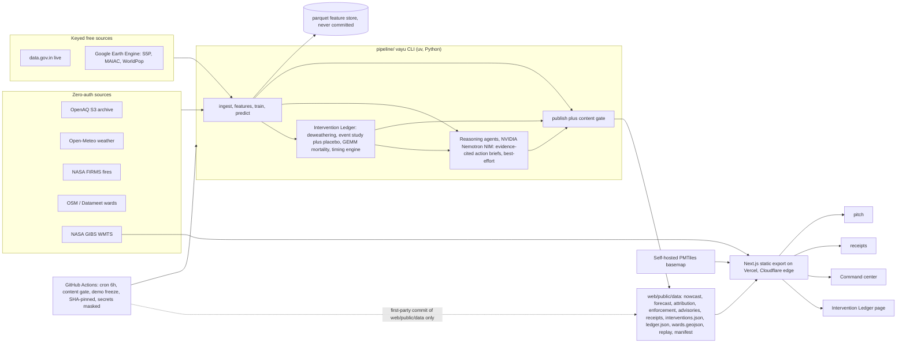

# VayuDrishti architecture

VayuDrishti is a static site backed by a batch pipeline. Nothing is computed at
request time. A `vayu` command-line pipeline fetches real public data, trains
models, runs the Intervention Ledger, and writes plain JSON into `web/public/data`.
A Next.js static export reads that JSON at the edge. GitHub Actions runs the
pipeline every six hours behind a content gate and commits only the refreshed
data. This shape keeps the serving path cheap, cacheable, and hard to attack:
there is no application server to exploit.

## System diagram

## Repository layout

- `pipeline/`: the `vayu` uv project (Python). Ingest, features, models, Ledger, reasoning agents, publish, content gate. Owner: vayu-data, vayu-models, and vayu-agents.
- `web/`: Next.js 15 static export, TypeScript strict, Tailwind, MapLibre GL, deck.gl, Zustand. Owner: vayu-web.
- `config/`: city YAML configs, JSON schemas, intervention calendars.
- `.github/workflows/`: `refresh.yml` (scheduled data refresh) and `ci.yml` (checks). Owner: vayu-ops.
- `docs/`: this file, the demo video script, the design spec.
- `scripts/`, `.githooks/`, `.humanize/`: the local and CI gates (secret scan, humanizer).

## The pipeline

The `vayu` CLI runs staged: ingest raw sources into a parquet feature store,
build features, train the LightGBM quantile models, predict, then publish. All
inference is precomputed. The feature store parquet stays local and is never
committed; only quantized JSON reaches the repo. Timestamps are stored in UTC and
converted from IST at ingest; every calendar feature uses Asia/Kolkata local time.

## The Intervention Ledger

The Ledger is the flagship capability. It answers, ward by ward and
weather-adjusted, whether Delhi's GRAP emergency measures worked, and what acting
earlier would have saved. Data flow:

1. **Deweathering**: meteorological normalization (Grange and Carslaw, 2019)
   produces a weather-neutral PM2.5 series per ward, so weather cannot be mistaken
   for policy effect.
2. **Calendar**: GRAP stage transitions come from real CAQM orders in
   `config/interventions/delhi.yaml`, each with a source link. No invented dates.
3. **Effect estimation**: an event study around each transition, placebo tests on
   matched high-pollution non-intervention days, and block-bootstrap confidence
   intervals. Output: `interventions.json`.
4. **Health translation**: GEMM exposure-response (Burnett et al., 2018) and
   WorldPop population turn avoided pollution into avoided premature deaths per
   ward, point estimate plus interval.
5. **Timing engine**: shifting a stage earlier in the model yields the change in
   exposure and lives. Output, with health results: `ledger.json`.

Every figure is labeled a modeled estimate, carries a confidence interval, and
lists its assumptions on `/receipts`. A stage with no measurable effect is
reported as such.

## Reasoning agents

A reasoning layer on NVIDIA Nemotron NIM turns the computed intelligence into
evidence-cited action briefs for priority wards: what to act on, why, and the
measured signals behind it, each claim linked to its source data. The agents run
at publish time inside the `vayu publish` flow. The brief step is best-effort: a
model or network failure is caught and logged, and the data refresh proceeds
regardless, so the agentic layer can never block a publish. Briefs are sanitized
and validated by the content gate like any other published text, and the
`NVIDIA_API_KEY` never reaches published output or logs.

## Refresh loop and CI

`refresh.yml` runs on a six-hour cron and on manual dispatch. There is no push
trigger, so the data commit cannot re-trigger the job. The job:

1. Checks out, sets up uv, decodes the base64 GEE service-account key into a
   restricted temp file with its secret fields masked in the logs.
2. Runs `vayu publish --city all` against real sources, writing to `web/public/data`.
3. Runs `vayu gate --all` as a required step. The gate validates schema, numeric
   ranges, string sanitization, and the lineage no-query-string rule. A nonzero
   exit aborts the job before anything is committed.
4. Runs the secret scan over the published JSON.
5. Commits only `web/public/data/**` with a first-party git step, no third-party
   action, and no-ops when there is no change. Vercel redeploys on that commit.

Every action is pinned to a full commit SHA with a version comment. The job holds
`contents: write` and nothing more. `DEMO_FREEZE` is a repository variable; setting
it to `1` skips the whole job through a job-level condition, so the demo can be
pinned to a known-good deployment on finale day without a code change.

`ci.yml` runs on every push and pull request, in parallel jobs:

- **secret-scan**: the custom pattern scan plus a version-and-checksum-pinned
  gitleaks over the working tree and full history.
- **humanize**: the prose gate over shipped documents.
- **pipeline**: ruff, type check, pytest, and a must-fail step that asserts the
  content gate rejects a poisoned fixture (acceptance 13).
- **web**: install, lint, and `pnpm build`, which type-checks the static export.

Language jobs skip cleanly until their subtree exists, so CI is green during the
parallel build and activates as each part lands.

## Security model

- **Secrets**: only in `.env` (gitignored) and GitHub Actions secrets, validated
  at pipeline start. Lineage records store base URL and resource id only; query
  strings are stripped, because data.gov.in carries its key there. Two gates
  enforce this: the content gate rejects any lineage URL with a query string, and
  the secret scan fails on any secret-shaped query parameter or credential format
  in the published JSON, the tracked tree, or the git history.
- **Headers**: `web/vercel.json` owns all security headers for the static export.
  HSTS with preload, `nosniff`, `X-Frame-Options: DENY`, `Referrer-Policy:
  no-referrer`, a `Permissions-Policy` that allows geolocation only for self and
  denies camera, microphone, and payment, and a strict CSP. The CSP enumerates the
  four GIBS tile hosts in `img-src` and `connect-src`, allows `worker-src blob:`
  for MapLibre workers, and upgrades insecure requests.
- **CSP tradeoff (A13, on record)**: a Next.js App Router static export emits
  inline hydration scripts, so a nonce or hash only `script-src` is not reachable
  without a server runtime. `script-src` therefore keeps `'unsafe-inline'`. The
  real XSS defense is in depth, not in that directive: publish-time sanitization
  strips HTML and control characters from all data strings, and the web layer
  renders every data-derived string through text nodes and escaped DOM, with no
  `dangerouslySetInnerHTML`. There is no HTML-injection sink to exploit. A
  build-time script-hash pass is a clean later upgrade to drop `'unsafe-inline'`.
- **Geolocation**: the entry page matches the browser location to the nearest
  supported city on the device. Coordinates never leave the browser, there is no
  IP-geolocation call, and the CSP has no host to allow for it.

## Performance and accessibility

The hero renders before the map hydrates, so the largest paint is text, not
WebGL. The map vendor chunk loads lazily and asynchronously (exception A7, on
record). Static assets are content-hashed and served immutable; data JSON is
served with a short edge cache and stale-while-revalidate. Targets: Lighthouse
performance at least 85, accessibility at least 95. Accessibility is designed in:
keyboard navigation, ARIA landmarks, AQI category shown by label and pattern and
never by color alone, reduced-motion support, and alt text.

## Deployment

The web app deploys to Vercel from `web/` as the project root, building to `out/`,
with Cloudflare in front for DNS, caching, and protection. The pipeline runs only
in GitHub Actions. There is no always-on server and no privileged surface: the
site is static files plus a scheduled batch job.

Branch protection on `main` is off for the hackathon window so the refresh job can
push data commits to `main` directly and Vercel redeploys from them. It is
revisited after the finale, at which point the Actions bot is exempted from the
ruleset or the refresh moves to a dedicated data branch.

## Data contracts

The published JSON shapes are frozen in `config/schemas/`. See the design spec,
sections 8 and 13, for the full field lists, including the Ledger additions
`interventions.json` and `ledger.json`. Consumers join on `ward_id`; nobody
re-derives it. A schema change travels with a message to its consumers in the same
commit.
