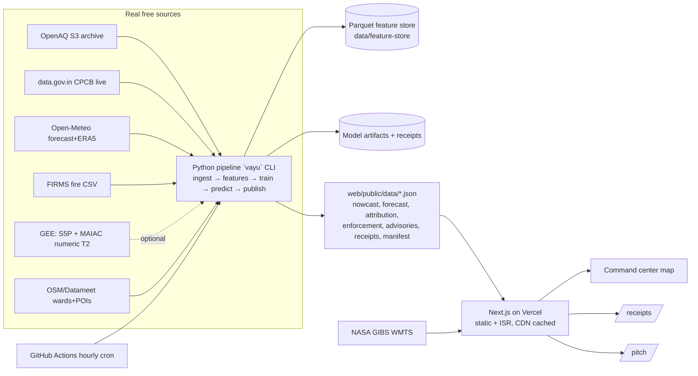

# VayuDrishti — Urban Air Quality Intelligence (ET AI Hackathon 2026)

Status: DRAFT for adversarial review | Ceremony tier: Standard | Date: 2026-07-22
Problem statement: #5 in `idea.md` (AI-Powered Urban Air Quality Intelligence for Smart City Intervention).
Judging: Innovation 25%, Business Impact 25%, Technical Excellence 20%, Scalability 15%, UX 15%.
Deliverables: working prototype, architecture diagram, presentation deck, demo video.

## 1. Vision

City administrators have 900+ CAAQMS stations but no intelligence layer: a CAG audit found only 31% of monitored cities have any response protocol tied to readings. VayuDrishti fuses ground stations, multiple satellites, meteorology, and fire detections into a single loop: **nowcast (gap-filled) → 24-72h ward-level forecast → source attribution → enforcement queue → citizen advisories in Indian languages**. Every number traces to a real, free, public source. Every model claim ships with a validation receipt.

Positioning: "IITM's Delhi DSS, rebuilt for every Indian city, on open data."

## 2. Users and use cases

1. **Municipal commissioner / SPCB officer**: opens command center, sees ward-level risk now + 72h, gets ranked enforcement actions with evidence bundles.
2. **Safety-conscious citizen**: ward advisory in their language (en/hi + regional), vulnerability-aware (schools, hospitals).
3. **Hackathon judge**: `/receipts` page shows measurable claims (RMSE vs persistence baseline, ablations, data lineage), `/pitch` sells it in 10 slides.

## 3. Data sources (all real, all free; auth tier marked)

| Source | What | Access | Auth tier |
|---|---|---|---|
| OpenAQ S3 archive (`openaq-data-archive`) | Historical CPCB hourly PM2.5/PM10/NO2/SO2/O3/CO, Feb-2025→now | S3 public, `--no-sign-request` | T0 none |
| data.gov.in CPCB CAAQMS (`3b01bcb8-0b14-4abf-b6f2-c1bfd384ba69`) | Live station snapshot, hourly | REST | T1 free key (user registers; sample key = throttled fallback) |
| OpenAQ API v3 | Live latest per station (alt live path) | REST | T1 free key |
| Open-Meteo forecast + archive (ERA5) + air-quality (CAMS) | Wind/temp/RH/precip/**boundary_layer_height**, forecast 7d + history 1940+; CAMS as covariate only, never ground truth | REST | T0 none |
| NASA FIRMS active fire (country/region CSV, 24h/48h/7d) | VIIRS 375m fire detections + FRP (stubble/waste burning signal) | open CSV download | T0 none (API MAP_KEY = T1 optional) |
| NASA GIBS WMTS | Satellite raster overlays: S5P NO2, MODIS Terra/Aqua AOD, VIIRS fires/AOD | open tile service | T0 none |
| Google Earth Engine: `COPERNICUS/S5P/OFFL/L3_NO2|SO2|CO|AER_AI`, `MODIS/061/MCD19A2_GRANULES` (MAIAC AOD) | Numeric satellite features per station/grid cell, 2018→now | GEE Python API | T2 user runs `earthengine authenticate` once |
| Datameet / HT Labs / OSM | Ward boundaries (GeoJSON), road density, built-up, POIs (schools/hospitals) | open | T0 none |
| Kaggle "Air Quality Data in India 2015-2020" | Pre-training hedge corpus | download | T1 kaggle account (optional) |
| IIT-Kanpur / TERI / SAFAR source apportionment PDFs | Soft ground truth for attribution sanity check | public PDFs | T0 none |

**Multi-satellite story (real, no fakery):** Sentinel-5P (TROPOMI), Terra + Aqua (MODIS MAIAC), Suomi-NPP + NOAA-20 (VIIRS) = 5 satellites. Two integration paths:
- **Visual (T0, always on):** GIBS WMTS overlays on the map — real imagery, zero auth.
- **Numeric (T2, feature path):** GEE extractor pulls per-cell/per-station time series into the feature store. Pipeline runs with or without these columns (LightGBM handles NaN natively); when enabled, T2 retrains and publishes an **ablation receipt** (skill with vs without satellite features).

**Rule: no synthetic data anywhere.** Gaps are filled by *models with uncertainty bounds and labels*, never by invented readings. CAMS is a model input feature, never a validation target.

## 4. Cities (launch set)

Delhi (primary; richest stations + ward files + inventories), Mumbai, Bengaluru. City = one YAML config (`config/cities/{city}.yaml`: bbox, timezone, wards file, station match rules, languages, inventory refs). Adding a city touches config only — this IS the scalability demo.

## 5. Gap-filling and modeling (the depth)

### 5.1 Nowcast fusion (spatial gap fill)
Target: PM2.5 (and derived CPCB AQI) on a 1km grid, hourly.
Features per cell/station: inverse-distance + nearest-k station aggregates, meteorology (wind vector, BLH, RH, temp, precip), satellite columns when present (S5P NO2/SO2/CO/AAI, AOD-550) with missing-indicators, FIRMS FRP upwind (24h, 100km sector), static land-use (road density 500m, built-up fraction, industrial distance), calendar (hour, dow, month, stubble season, Diwali window from public holiday calendar).
Model: LightGBM **quantile regression** (p10/p50/p90) → every gap-filled value carries an uncertainty band. Cloud/monsoon satellite gaps: missing-indicators + 7-day median composites; model degrades gracefully.
Validation: leave-one-station-out cross-validation per city → spatial RMSE/MAE vs IDW baseline.

### 5.2 Forecast (24/48/72h, ward level)
Features: nowcast state, Open-Meteo *forecast* meteo (wind, BLH, precip), persistence + diurnal/seasonal encodings, recent FIRMS activity upwind.
Model: LightGBM per horizon bucket, quantile outputs.
Validation: **rolling-origin backtest** over ≥90 days holdout vs persistence baseline (t+h = t) and seasonal-naive. Receipts: RMSE, MAE, skill% = (1 − RMSE_model/RMSE_persistence), per city × horizon. Acceptance: skill > 0 on every horizon for Delhi; report honestly wherever it isn't for other cities.

### 5.3 Source attribution (per ward, with confidence)
Method stack (transparent, citable — not a black box):
1. **CPF (conditional probability function)** wind-sector analysis per station: which directions deliver high-percentile PM2.5.
2. **Feature decomposition**: SHAP on the fusion model groups contributions into source proxies (traffic ← road density × rush hour × NO2; biomass ← FIRMS upwind × season; industry ← industrial distance × SO2; dust ← RH/wind/coarse PM10/PM2.5 ratio; residential/other ← remainder).
3. **Season/calendar priors** from published inventories.
Output: per-ward source shares + confidence tier (high/med/low). Sanity check vs IIT-K/TERI/SAFAR published ranges → shown on `/receipts` as "within literature range: yes/no per sector". Label: *estimated attribution*, not measurement.

### 5.4 Enforcement intelligence
Rank wards by: persistence of hotspot (days above threshold) × attributed controllable share × trend. Each item = evidence card: 72h sparkline, dominant source + confidence, map snippet, suggested action (from a fixed action taxonomy per source type), nearest registered sources where public registries exist (CPCB grossly-polluting-industries list). Label recommendations as decision support.

### 5.5 Citizen advisories
Ward risk (forecast p90 + vulnerability count from OSM schools/hospitals) → advisory text in en + hi + city language (kn for Bengaluru, mr for Mumbai). Generated at **build/publish time** by templates (LLM-authored during build, no runtime LLM cost). IVR/WhatsApp = mocked UI flows in demo (clearly labeled mock), web advisories fully real.

## 6. Architecture

- **Pipeline** (`ingest/`, `models/` as one Python package `vayu`, managed by `uv`): deterministic CLI stages; every output JSON carries `generated_at` + source manifest (URL + fetch timestamp + row counts) → data lineage provable.
- **Web** (`web/`): Next.js 15 App Router, TypeScript strict, Tailwind v4, MapLibre GL + deck.gl (no map tokens), Zustand for UI state. Pages: `/` (national → city command center), `/city/[id]` (ward drill-down, forecast timeline slider, attribution, enforcement queue, advisories), `/receipts` (validation receipts + ablations + lineage), `/pitch` (10-slide Kawasaki deck, standalone), `/about-data` (sources, gaps, honest labeling).
- **Refresh loop**: GitHub Actions cron (hourly) runs `vayu publish` → commits refreshed JSONs → Vercel auto-deploys. Zero servers, zero cost, real CI/CD visible publicly. Local `pnpm dev` + `uv run vayu publish` works without Actions.
- **Serving model**: all inference precomputed at publish time; requests hit static CDN JSON. p95 API ≈ CDN latency. No runtime Python.

## 7. Security, performance, accessibility

- No secrets client-side; keys only in `.env` (gitignored) / GitHub Actions secrets; `.env.example` committed. Zod-style validation of env at pipeline start (Python: pydantic-settings).
- Static site: security headers via `next.config` (HSTS, X-Content-Type-Options, X-Frame-Options, Referrer-Policy, strict CSP — self-hosted assets only, GIBS/tile endpoints explicitly allowed in `img-src`/`connect-src`).
- No user input persisted, no auth surface, no DB → attack surface ≈ static CDN. **No `/super-admin`** (assumption A4 — nothing privileged exists to administer).
- Performance: LCP < 2.5s (hero renders before map hydration), map vendor chunk lazy-loaded (budget exception A7: maplibre+deck.gl ≈ 250-350KB gz in their own async chunk; initial route JS < 200KB gz).
- Accessibility WCAG 2.2 AA: full keyboard nav, ARIA landmarks/labels, AQI never color-only (category label + pattern), reduced-motion respected, alt text, focus order. Lighthouse a11y ≥ 95.
- Structured logging in pipeline (Python `structlog`, JSON); web has no server logic to log.

## 8. Data contracts (T1↔T2↔T3 interface — frozen after review)

- `data/feature-store/{city}/hourly.parquet`: `ts_utc, station_id, lat, lon, pm25, pm10, no2, so2, o3, co, wind_speed_10m, wind_dir_10m, temp_2m, rh_2m, precip_mm, blh_m, s5p_no2?, s5p_so2?, s5p_co?, s5p_aai?, aod550?, frp_upwind?, fire_count_upwind?, road_density, builtup_frac, industrial_dist_km, ward_id`
- `web/public/data/{city}/nowcast.json`: `{generated_at, grid: [{cell_id, lat, lon, pm25_p10, pm25_p50, pm25_p90, aqi, category}], wards: [{ward_id, name, aqi, pm25_p50, confidence}]}`
- `web/public/data/{city}/forecast.json`: same ward shape × horizons `[24,48,72]`
- `web/public/data/{city}/attribution.json`: `{ward_id, shares: {traffic, industry, biomass, dust, residential_other}, confidence, method_notes}`
- `web/public/data/{city}/enforcement.json`: ranked `[{ward_id, source_type, priority_score, evidence: {trend_72h: number[], persistence_days, attribution_confidence}, action}]`
- `web/public/data/{city}/advisories.json`: `[{ward_id, risk_level, langs: {en, hi, <regional>}}]`
- `web/public/data/receipts.json`: `{cities: {city: {nowcast_cv: {rmse, mae, baseline_rmse}, forecast: [{h, rmse, mae, persistence_rmse, skill_pct, n}], attribution_check: [{sector, ours, literature_range, within}], ablation?: {with_sat, without_sat}}}, lineage: [{source, url, fetched_at, rows}]}`
- `web/public/data/manifest.json`: cities list + file index + `generated_at`.
JSON schemas live in `config/schemas/*.json`; web validates with zod mirrors; pipeline validates before publish. Contract change = SendMessage to affected teammate + update schema file in same commit.

## 9. Acceptance criteria (machine-checkable)

1. `uv run vayu publish --city delhi` exits 0 producing all §8 files from **real fetched data**; manifest lists real source URLs + timestamps.
2. `receipts.json` shows forecast skill_pct > 0 vs persistence for Delhi at 24/48/72h on a ≥90-day rolling backtest; honest values (even if negative) for Mumbai/Bengaluru.
3. Nowcast LOSO CV beats IDW baseline RMSE for Delhi.
4. `pnpm build` passes (typecheck + lint zero errors); `/`, `/city/delhi`, `/receipts`, `/pitch`, `/about-data` render.
5. 3 cities selectable, each with ward polygons + nowcast + forecast + advisories (en/hi/regional).
6. GIBS satellite overlays (S5P NO2, AOD, fires) toggle on the city map.
7. `grep`-audit: no API keys in `web/` bundle or repo history; `.env.example` present.
8. Lighthouse: a11y ≥ 95, performance ≥ 85 on `/` (throttled default).
9. `/pitch` = 10 slides, standalone, zero external deps.
10. Attribution sanity table on `/receipts` compares vs published Delhi apportionment ranges.
11. Historical smog-episode replay mode (Nov 2025 window from archive) works in demo — because July is monsoon (low AQI); demo shows live + replay.
12. `CHANGELOG.md` current; README passes humanizer gate (no em dashes, no AI-tell prose).

## 10. Assumption ledger

| # | Assumption / parked decision | Default taken | Owner |
|---|---|---|---|
| A1 | Launch cities Delhi, Mumbai, Bengaluru | proceed | user may swap |
| A2 | Name "VayuDrishti" (working title) | proceed | user may rename |
| A3 | Numeric satellite features need one-time `earthengine authenticate` (T2). Until then: GIBS visual + T0 numeric sources; ablation retrain after auth | proceed | user step |
| A4 | No `/super-admin` (global standard) — static site, zero privileged ops; revisit if backend appears | proceed | on record |
| A5 | Deploy = Vercel free; repo push to github.com/divyamohan1993 needs `gh` auth at integration | park until integration | user |
| A6 | Advisory text generated at publish time (templates), no runtime LLM spend | proceed | — |
| A7 | Bundle budget exception: map vendor chunk async, initial route < 200KB gz | proceed | on record |
| A8 | Live layer needs ONE free key (data.gov.in preferred, OpenAQ alt); until provided, "latest available" from archive, labeled with data age | proceed | user step (5 min) |
| A9 | ET hackathon finale ~Aug 2 (fuzzy) — verify on Unstop | — | user |
| A10 | Wards: Delhi files may be 272-ward vintage vs current 250; use best available vintage, note on /about-data | proceed | — |

## 11. Team plan (Opus teammates, parallel)

| Teammate | Scope | Key outputs |
|---|---|---|
| `vayu-data` | `vayu` package: ingest (OpenAQ S3 backfill 18mo × 3 cities, live pollers, Open-Meteo, FIRMS, wards/OSM static features, GEE extractor stub-ready), feature store builder, schemas, manifest/lineage | feature-store parquet + `vayu ingest/features` green on real data |
| `vayu-models` | nowcast fusion, forecast, attribution, enforcement ranking, advisories generation, receipts; `vayu train/predict/publish` | §8 JSONs + receipts with real validation numbers |
| `vayu-web` | Next.js app, cinematic UI (dmj:art-directing method), map + GIBS overlays, all pages, a11y, /pitch | `pnpm build` green, pages per §9 |
| `vayu-ops` | GH Actions cron workflow, Vercel config, README, architecture diagram render, .env.example, humanizer gate, CHANGELOG, demo video script | CI/CD + docs complete |

Coordination: SendMessage peer-to-peer (schema handshakes: data↔models, models↔web on JSON contracts, ops↔all), progress updates to `main` at milestones, contracts frozen in `config/schemas/`. Fixture JSONs (clearly labeled `_fixture`, generated from real Delhi archive sample) allowed for web dev only until models publish real ones; fixtures never demoed.

## 12. Risks (worst case on record)

- **Crowded pick**: judges see many AQI dashboards → we lead demo with receipts (skill%, ablation, lineage) in first 30s. If this goes wrong: we look like dashboard #11.
- **OpenAQ S3 schedule gap or CPCB outage during finale**: mirror priority-station parquet locally on day 1; replay mode always works offline.
- **Monsoon demo dullness**: replay Nov 2025 episode (real archive data) + live view side by side.
- **Skill ≤ 0 on some city/horizon**: report honestly on /receipts; honesty is the differentiator, not a failure.
- **GEE auth never provided**: satellite stays visual-only + numeric fires; ablation receipt shows what satellite adds where enabled. Story intact.
