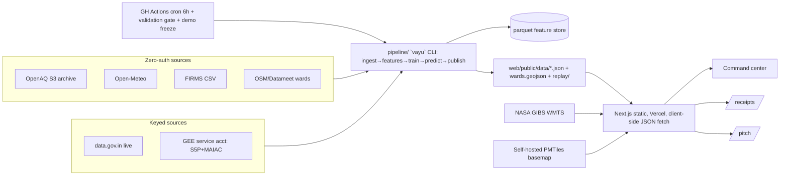

# VayuDrishti — Urban Air Quality Intelligence (ET AI Hackathon 2026)

Status: v2 APPROVED-FOR-BUILD (post adversarial review, 2 lenses, 26 findings resolved) | Date: 2026-07-22
Problem: #5 in `idea.md`. Judging: Innovation 25, Business Impact 25, Technical Excellence 20, Scalability 15, UX 15.
Deliverables: working prototype, architecture diagram, deck, demo video.

## 1. Vision

900+ CAAQMS stations, no intelligence layer (CAG: only 31% of monitored cities have response protocols). VayuDrishti closes the loop: **gap-filled nowcast → 24-72h ward forecast → source attribution (labeled estimate) → enforcement queue → citizen advisories in Indian languages** — every number from a real free public source, every model claim shipped with a validation receipt. Positioning: "IITM's Delhi DSS, rebuilt for every Indian city, on open data."

## 2. Users

Municipal/SPCB officer (command center, evidence-backed actions), citizen (ward advisory in their language), judge (`/receipts` = measurable claims, `/pitch` = 10 slides).

## 3. Data sources (all real, all free)

| Source | What | Auth |
|---|---|---|
| OpenAQ S3 `openaq-data-archive` | CPCB hourly history Feb-2025→now (PM2.5/PM10/NO2/SO2/O3/CO) | none |
| data.gov.in CPCB resource `3b01bcb8-0b14-4abf-b6f2-c1bfd384ba69` | live station snapshot | free key (user) |
| OpenAQ API v3 | live latest (alt path) | free key (user) |
| Open-Meteo forecast + ERA5 archive + CAMS AQ | wind/temp/RH/precip/BLH; CAMS = covariate only, NEVER validation target | none |
| NASA FIRMS country CSV (24h/48h/7d) | VIIRS 375m fires + FRP | none (MAP_KEY optional) |
| NASA GIBS WMTS (`gibs.earthdata.nasa.gov`, also `gibs-{a,b,c}`) | satellite raster overlays: S5P NO2, MODIS AOD, VIIRS | none |
| Google Earth Engine `COPERNICUS/S5P/OFFL/L3_{NO2,SO2,CO,AER_AI}`, `MODIS/061/MCD19A2_GRANULES` | numeric satellite features 2018→now | **GEE service-account JSON** (user; headless-capable, works in Actions) |
| NASA Earthdata token | LAADS/FIRMS archive backup path | free token (user, backup) |
| Datameet/HT Labs/OSM (Geofabrik extracts) | wards, roads, built-up, schools/hospitals | none |
| IIT-K/TERI/SAFAR apportionment PDFs | attribution directional sanity refs | none |

**Satellites (5, real):** Sentinel-5P (TROPOMI), Terra + Aqua (MODIS MAIAC AOD), Suomi-NPP + NOAA-20 (VIIRS fires/AOD). Visual = GIBS (zero-auth, always on). Numeric = GEE service account (live in cron once key exists). Parquet satellite columns ALWAYS present, NaN when unavailable; `manifest.sat_numeric` boolean flags whether numeric path active; ablation receipt (skill with vs without) when active.
**Rule: zero synthetic data.** Gaps filled only by models with uncertainty bands and labels.

## 4. Cities (revised per review)

- **Delhi = deep**: all surfaces, full validation receipts, replay.
- **Mumbai = standard**: nowcast + forecast + advisories, validated.
- **Bengaluru = config-only, live**: pipeline runs, JSONs publish, map works; skips curated ward-cleaning, backtest receipt, verified translations. Demo moment: "adding a city = one YAML" (Scalability proof).
City config `config/cities/{city}.yaml`: bbox, tz, wards source + `ward_id_field`, `station_match` (data.gov.in name → OpenAQ location id), languages, inventory refs.

## 5. Modeling (with review hardening)

### 5.0 Conventions (FROZEN — all teammates)
- **Time**: storage = UTC ISO-8601 `Z`. CPCB/data.gov.in timestamps are IST → convert at ingest (unit test on boundary). ALL calendar/diurnal features from `Asia/Kolkata` local time. UI displays IST with "IST" suffix.
- **Grid**: EPSG:4326, cell 0.01°×0.01° ("≈1km"), origin = city bbox SW corner floored to 0.01°, `cell_id = "{city}_{row}_{col}"`, `row = floor((lat−lat0)/0.01)`. `nowcast.json` carries `grid_meta {lat0, lon0, cell_deg, crs}`. Owner: `vayu-data` (`vayu/grid.py`).
- **Distances/buffers**: computed in projected CRS (UTM 43N Delhi/Mumbai... use per-city UTM zone from config), never degrees.
- **ward_id**: `"{city}_{zeropad3(id_field)}"` baked into published `wards.geojson` by `vayu-data`; every consumer joins on it, nobody re-derives. Stations/cells outside ward polygons get `ward_id = "{city}_unassigned"`, kept not dropped.
- **station_id**: canonical = OpenAQ location id; data.gov.in names mapped via config `station_match`.
- **Upwind sector** (`vayu/upwind.py`, owner data): apex = station or ward centroid; include FIRMS detections within ±45° of `wind_dir_10m` bearing (Open-Meteo convention: direction wind blows FROM, degrees clockwise from N), great-circle ≤100km; `frp_upwind` = ΣFRP trailing 24h, `fire_count_upwind` = count.
- **AQI** (`vayu/aqi.py`, owner models): CPCB National AQI methodology, breakpoints from the official CPCB document (fetch it, do not reconstruct from memory). Grid/ward headline = **PM2.5 sub-index on trailing-24h mean**, labeled "PM2.5 sub-index (24h)". Full multi-pollutant AQI (max of sub-indices, ≥3 pollutants incl. one PM) only at stations having them. Category strings from one constants module; breakpoint table published on `/about-data`.
- **Quantiles**: p50 + p90 only (p10 cut).
- **Confidence**: enum `high|med|low`, thresholds fixed by models, used identically everywhere.

### 5.1 Nowcast fusion (spatial gap fill)
LightGBM quantile (p50/p90) on 0.01° grid, hourly. Features: nearest-k + IDW station aggregates, meteo (wind vector, BLH, RH, temp, precip), satellite numeric (NaN-robust + missing indicators + 7-day medians), FIRMS upwind, land-use (road density 500m, built-up frac, industrial dist — projected CRS), calendar (IST), station density. Validation: **LOSO CV stratified by distance-to-nearest-retained-station** with degradation curve, vs IDW baseline. No aggregate-only number.

### 5.2 Forecast (24/48/72h, ward level)
Ward level is deliberate (actionable unit); defended on `/pitch` + `/receipts` vs the brief's "1km" phrasing. Features: nowcast state **as of origin time only** (walk-forward snapshot, no future stations), Open-Meteo forecast meteo, persistence/diurnal/seasonal encodings, recent upwind FIRMS. LightGBM per horizon, p50/p90.
Validation: rolling-origin backtest, ≥90 days, **embargo ≥ horizon + max feature lag (≥72h+)** between train end and test origin, vs persistence and seasonal-naive. **Committed target: skill > 0 at 24h Delhi; 48/72h reported honestly whatever they are.** Single-winter honesty: training data = Feb-2025→now (one winter); no multi-season generalization claims; stated plainly on `/receipts`.
**t=0 seam**: timeline slider's "now" = nowcast ward value (area-weighted cell mean); forecast series starts at h=24.

### 5.3 Source attribution (labeled estimate)
Primary = **CPF wind-sector analysis** per station (which bearings deliver high-percentile PM2.5) + land-use/calendar/inventory-anchored share heuristics. Output: per-ward shares {traffic, industry, biomass, dust, residential_other} + confidence tier + method notes. **Validation = directional correctness**: CPF bearing peaks vs known source geography (Delhi NW stubble belt in season, named industrial areas), shown on `/receipts`; inventory comparison labeled "consistency check", not accuracy claim (circularity acknowledged). SHAP = optional Delhi-only ablation, time permitting. Attribution NEVER claims measured emissions.

### 5.4 Enforcement queue
Ranked by **measured** signals: exceedance persistence (days over threshold) × 72h trend × population/vulnerability weight. Attribution appears as confidence-tagged label on the card, not a rank multiplier. Evidence card: sparkline, dominant source label + confidence, map snippet, action from fixed taxonomy. Labeled decision support.

### 5.5 Advisories
Ward risk (forecast p90 + OSM vulnerable-site count) → advisory text en + hi + regional (Delhi hi/en, Mumbai mr, Bengaluru slide-only). Generated at publish time from templates (LLM-authored at build; runtime-free). Text is data → rendered as plain text ONLY (see security). IVR/WhatsApp = labeled mock flows.

## 6. Architecture

- **Layout**: `pipeline/` (uv project, package `vayu`), `web/` (Next.js 15, TS strict, Tailwind v4, MapLibre GL + deck.gl, Zustand), `config/` (cities, schemas), `.github/workflows/`, `docs/`.
- **Basemap**: self-hosted **Protomaps PMTiles** city extracts (OSM raster tile policy forbids app use; self-hosting = CSP-clean + works offline at finale). GIBS overlays when online.
- **Refresh loop**: Actions cron **6h** (hourly only if finale needs it) → `vayu publish` → **pydantic content gate** (schema + sanity ranges + sanitization) → first-party git commit step (no third-party commit action) → Vercel redeploy. **Demo freeze**: schedule disabled via one workflow env toggle Aug 1-2; demo pinned to known-good deployment. Actions pinned to full commit SHAs, minimal `permissions:`, secrets masked.
- **Location-aware entry**: on load, browser Geolocation API (graceful permission prompt) → client-side match to nearest supported city (haversine vs city centroids from manifest) → auto-open that city; denial/unsupported/outside-coverage → nearest-city banner + manual picker (always visible). Coordinates never leave the device — no IP-geolocation service, no external call, CSP untouched.
- **Web data binding**: client-side fetch of `/data/*.json` (bad hourly file degrades one panel, never the build). Coords quantized (3 decimals) to keep payloads and git history small; feature-store parquet NEVER committed.
- **Map resilience**: CSP includes `worker-src blob:`; `img-src`/`connect-src` enumerate `gibs.earthdata.nasa.gov` + `gibs-{a,b,c}.earthdata.nasa.gov` + self; WebGL2 feature-detect → static ward-choropleth SVG fallback; demo-bbox GIBS tiles pre-cached for offline.
- **Serving**: all inference precomputed; requests hit CDN JSON.

## 7. Security / performance / accessibility

- Secrets only in `.env` (gitignored) + Actions secrets; `.env.example` committed; pydantic-settings validates at pipeline start. **Manifest/lineage store base URL + resource id only — query strings stripped** (data.gov.in puts the key in the query string). CI secret-scan over `web/public/data/*.json` + no-secrets grep gate.
- **XSS**: station/ward/POI names + advisory text = untrusted. Map popups via `setText`/escaped DOM only; zero `dangerouslySetInnerHTML` on data-derived strings; publish-time content sanitization (strip HTML/control chars), not just shape validation.
- Headers: HSTS, X-Content-Type-Options, X-Frame-Options, Referrer-Policy, strict CSP (self + enumerated tile hosts).
- Performance: LCP < 2.5s (hero before map hydration); map vendor chunk lazy async (initial route JS < 200KB gz; exception A7 on record). Lighthouse perf ≥ 85.
- Accessibility WCAG 2.2 AA: keyboard nav, ARIA landmarks, AQI category never color-only (label + pattern), reduced motion, alt text. Lighthouse a11y ≥ 95.
- Pipeline logging: structlog JSON, no secrets in logs.

## 8. Data contracts (owner in brackets; frozen END OF DAY 2 in `config/schemas/*.json`; change = schema edit + SendMessage to consumers in same commit)

- [data] `pipeline` parquet `data/feature-store/{city}/hourly.parquet`: `ts_utc, station_id, lat, lon, pm25, pm10, no2, so2, o3, co, wind_speed_10m, wind_dir_10m, temp_2m, rh_2m, precip_mm, blh_m, s5p_no2, s5p_so2, s5p_co, s5p_aai, aod550, frp_upwind, fire_count_upwind, road_density, builtup_frac, industrial_dist_km, ward_id` (satellite/fire cols always present, NaN allowed).
- [data] `web/public/data/{city}/wards.geojson`: polygons + `properties.ward_id` (convention §5.0), `name`.
- [models] `web/public/data/{city}/nowcast.json`: `{generated_at, fixture?, grid_meta, grid:[{cell_id, pm25_p50, pm25_p90, subindex24h, category}], wards:[{ward_id, name, pm25_p50, pm25_p90, subindex24h, category, confidence}]}`
- [models] `web/public/data/{city}/forecast.json`: `{generated_at, fixture?, horizons_h:[24,48,72], wards:[{ward_id, name, series:[{h, pm25_p50, pm25_p90, subindex24h, category, confidence}]}]}`
- [models] `attribution.json`: `{generated_at, fixture?, wards:[{ward_id, shares:{traffic,industry,biomass,dust,residential_other}, confidence, method_notes}]}`
- [models] `enforcement.json`: `{generated_at, fixture?, ranked:[{ward_id, source_label, confidence, priority_score, evidence:{trend_72h:number[], persistence_days, exceedance_pct}, action}]}`
- [models] `advisories.json`: `{generated_at, fixture?, wards:[{ward_id, risk_level, langs:{en, hi, regional?}}]}` (envelope form ratified 2026-07-22: every §8 JSON = object envelope with generated_at + fixture flag)
- [models] `receipts.json`: `{cities:{...nowcast_cv (stratified curve), forecast per h (rmse, mae, persistence_rmse, seasonal_naive_rmse, skill_pct, n, embargo_h), attribution_directional_checks, ablation?}, honesty_notes[], lineage:[{source, base_url, resource_id, fetched_at, rows}]}`
- [models] `web/public/data/{city}/replay/{YYYY-MM-DD}/…` same shapes from **out-of-fold predictions only** + [models] `replay/index.json`.
- [models] `web/public/data/manifest.json`: cities, file index, `generated_at`, `sat_numeric`, `fixture`.
**Fixture protocol**: models generates schema-valid fixtures FROM REAL Delhi archive sample into the real paths with `"fixture": true`; web shows "sample data" banner on flag; handoff = overwrite same paths, flip flag, SendMessage.

## 9. Acceptance criteria (machine-checkable)

1. `uv run vayu publish --city delhi` exit 0, all §8 files from real fetched data, lineage populated, no query strings.
2. Delhi 24h forecast skill_pct > 0 vs persistence (rolling-origin, embargo stated); 48/72h + Mumbai reported honestly on `/receipts`.
3. Delhi nowcast stratified LOSO curve beats IDW at every distance bucket ≤5km.
4. `pnpm build` green (typecheck+lint); `/`, `/city/delhi`, `/receipts`, `/pitch`, `/about-data` render.
5. Delhi deep + Mumbai standard + Bengaluru config-only all selectable with live JSONs; "add a city" = YAML + pipeline run, demoed.
6. GIBS overlays toggle; WebGL2-absent fallback renders choropleth.
7. Secret scan green: no keys in bundle, repo history, or published JSONs.
8. Lighthouse a11y ≥ 95, perf ≥ 85 on `/`.
9. `/pitch` 10 slides standalone.
10. Attribution directional checks pass for Delhi (stubble bearing in season, ≥1 named industrial sector) on `/receipts`.
11. Replay = Nov-2025 window from out-of-fold predictions, works offline.
12. `CHANGELOG.md` current; prose passes humanizer gate.
13. Cron validation gate blocks malformed publish (tested with poisoned fixture); demo-freeze toggle verified.
14. Geolocation auto-detect: grant → nearest city opens; deny → picker works; coords provably never sent anywhere (network tab clean).
15. Intervention Ledger (§13): Delhi GRAP 2025-26 winter stage transitions each have a weather-normalized effect estimate with bootstrap CI AND ≥1 passing placebo test; all dates trace to cited CAQM orders.
16. Avoided-mortality counterfactuals: GEMM-based, WorldPop-weighted, per ward, point + CI, labeled "modeled estimate"; method citations rendered on `/receipts`.
17. Counterfactual timing scenario ("Stage III 48h earlier") renders with exposure delta + avoided-deaths delta + CI on the Ledger page.

## 10. Assumption ledger

| # | Assumption | Status |
|---|---|---|
| A1 | Cities: Delhi deep, Mumbai standard, Bengaluru config-only | revised per review |
| A2 | Name "VayuDrishti" | user may rename |
| A3 | GEE via service account `vayudrishti-ee@dmjone` — CREATED, roles viewer + serviceUsageConsumer, key at `~/.config/vayudrishti/gee-sa.json`, smoke-tested vs S5P 2026-07-22. `.env`: `GEE_SERVICE_ACCOUNT_JSON_PATH`, `GEE_PROJECT=dmjone` | DONE |
| A4 | No `/super-admin` — static site, zero privileged ops | on record |
| A5 | Vercel free deploy; repo push needs `gh` auth | parked to integration |
| A6 | Advisories publish-time generated, runtime LLM-free | proceed |
| A7 | Map vendor chunk async exception | on record |
| A8 | Live layer needs one free key (data.gov.in preferred); until then archive-latest labeled with data age | user step |
| A9 | Finale ~Aug 2 (verify on Unstop) | user |
| A10 | Ward vintage best-available, noted on /about-data; BMC 24 vs BBMP 198 granularity noted | proceed |
| A11 | Basemap REVISED 2026-07-23: dark data-canvas (no street tile stack) + self-hosted static GeoJSON of major roads + ward labels for orientation + GIBS overlays. Rationale: policy-clean, fully offline, zero tile tooling risk; PMTiles dropped (pmtiles CLI unavailable, marginal value) | ratified |
| A12 | Single-winter training window; claims scoped, stated on /receipts | new |
| A14 | Next pinned to 15 (not 16): ecosystem-proven with deck.gl+MapLibre+static export; Turbopack map-stack risk not worth it time-boxed; reversible one-liner | ratified 2026-07-22 |

## 11. Team plan (4 Opus teammates, parallel; SendMessage coordination; schema freeze end of Day 2)

| Teammate | Owns | Definition of done |
|---|---|---|
| `vayu-data` | `pipeline/` ingest: OpenAQ S3 backfill (3 cities), data.gov.in poller, Open-Meteo, FIRMS, OSM/wards (wards.geojson + ward_id bake), GEE extractor (service-acct ready, NaN-graceful), feature store, `vayu/grid.py`, `vayu/upwind.py`, parquet + wards schemas, city configs | `vayu ingest/features --city X` green on real data ×3 cities; conventions §5.0 unit-tested |
| `vayu-models` | `vayu/aqi.py`, nowcast, forecast, attribution, enforcement, advisories, receipts, replay generation, publish + content gate, 7 web-JSON schemas, fixtures | §8 JSONs real, acceptance 1-3, 10-11 numbers |
| `vayu-web` | `web/`: cinematic command center (invoke dmj:art-directing method), MapLibre+deck.gl+PMTiles, GIBS toggles, WebGL2 fallback, all pages, a11y, /pitch, /about-data | acceptance 4-6, 8-9 |
| `vayu-ops` | `.github/workflows/` (cron + gate + freeze toggle + SHA-pinned), vercel config, README, .env.example, secret-scan gate, humanizer gate, CHANGELOG, architecture diagram, demo video script | acceptance 7, 12-13 |

Peer protocol: milestone updates to `main`; blockers → SendMessage the owning peer directly; contract change = schema file + SendMessage same commit; no remote push until ops confirms `gh` auth with user.

## 13. Intervention Ledger — the world-first capability (v3 addendum, 2026-07-22)

**Claim (precise, defensible):** the first *operational* system anywhere that answers, ward by ward and weather-adjusted, whether a city's emergency pollution measures (Delhi GRAP stages) actually worked, and estimates what acting earlier would have saved in exposure and premature deaths. One-off academic GRAP evaluations exist (city-level, retrospective papers); IITM DSS forecasts; no deployed system does continuous ward-level causal audit with mortality counterfactuals. Novelty statement + prior-art citations rendered on `/receipts` in exactly this scoped wording.

**Method stack (all peer-reviewed, composed — research-level depth):**
1. **Weather normalization (deweathering)**: Grange & Carslaw meteorological-normalization method (Atmos. Chem. Phys. 2019) on our LightGBM stack — resample meteorology, predict counterfactual "weather-neutral" PM2.5 series per station/ward. Kills the "it rained, not the policy" confound.
2. **Real intervention calendar**: Delhi GRAP stage transitions for winter 2025-26 compiled from actual CAQM orders (public record), each dated entry carries its source URL. `config/interventions/delhi.yaml`. Zero invented dates.
3. **Causal effect estimation**: event-study around each stage transition on the weather-normalized series; **placebo tests** on matched high-pollution non-intervention days (defeats the regression-to-mean attack — GRAP triggers when pollution is already high); block-bootstrap CIs. Assumptions listed explicitly on `/receipts`.
4. **Health translation**: GEMM exposure-response (Burnett et al., PNAS 2018) hazard ratios + WorldPop 100m population (via GEE, service account live) aggregated per ward → avoided exposure (person-µg/m³-hours) and avoided premature deaths, point + CI, labeled modeled estimates.
5. **Counterfactual timing engine**: shift intervention date in the normalized series model ("Stage III 48h earlier") → delta exposure → delta deaths, with CI. The demo line: "GRAP Stage III saved an estimated N lives in NW Delhi; acting 48h earlier would have saved M more."

**Honesty-by-design**: if a stage shows no detectable effect, the Ledger says so — a null accountability finding is itself a headline capability. Every number carries CI + assumptions; every date carries a source.

**New contracts** [owner models; freeze with the rest]:
- `web/public/data/delhi/interventions.json`: `{calendar:[{stage, start_utc, end_utc, source_url}], series:[{ts_utc, pm25_raw, pm25_normalized}], effects:[{stage_transition, effect_ugm3, ci_low, ci_high, placebo_pass, n_days, method_notes}]}` (series = city-level hourly or 3h, covers the ribbon chart window)
- `web/public/data/delhi/ledger.json`: `{wards:[{ward_id, effect_ugm3, effect_ci_low, effect_ci_high, avoided_exposure_pugh, avoided_deaths, ci_low, ci_high}], counterfactuals:[{scenario, delta_exposure, delta_deaths, ci_low, ci_high}], citations[]}` (per-ward effect fields feed the effect map)

**Team deltas**: data = GRAP calendar compilation (real CAQM orders) + WorldPop ward population via GEE; models = deweathering, event-study + placebo + bootstrap, GEMM, timing engine, 2 new schemas; web = Ledger flagship page (normalized-vs-raw ribbon over stage timeline, ward effect map, avoided-deaths counters with CI, timing slider, citations); ops = README/pitch/video updated to lead with the Ledger.

**Satellite expansion slots** (user can register more): GEMS geostationary (hourly Asia AQ, NIER registration) and INSAT-3D/3DR AOD (ISRO MOSDAC registration — Indian satellite for Indian air). Pipeline exposes optional extractor slots; absence never blocks.

## 14. Agentic Actionable-Inference Layer — Nemotron (v4 addendum, 2026-07-22)

**What**: a reasoning-agent framework that turns VayuDrishti's published intelligence (nowcast, forecast, attribution, enforcement, ledger, receipts) into **verified, evidence-cited Action Briefs** — the step from "risk picture" to "do this, in this window, expect this effect, here is the proof". Model: `nvidia/nemotron-3-ultra-550b-a55b` via hosted NIM (`https://integrate.api.nvidia.com/v1`, OpenAI-compatible), key `NVIDIA_API_KEY` (present in `.env`).

**Model capabilities used (per NIM reference doc):** thinking mode (`chat_template_kwargs: {enable_thinking: true, force_nonempty_content: true}`), `reasoning_budget` hard ceiling per role, OpenAI-format tool calling with reasoning, `</think>`-tag trace parsing, streaming (copilot path), temperature/top_p tuned per role. No native `response_format` json-schema → final answer via a `submit_brief` tool whose parameters ARE the brief schema + pydantic validation + max-2 repair loop.

**Agent roles (pipeline `vayu/agents/*`, runs at publish time):**
1. **Situation Analyst** (thinking on, ~8k budget): tool-scans city artifacts, finds compound emerging risks (forecast band crossings × upwind fires × wind alignment × attribution shifts).
2. **Causal Strategist** (thinking on): joins situation to interventions/ledger — which measure historically moved this condition, expected effect with CI from OUR causal receipts, not folklore.
3. **Action Drafter** (thinking on, smaller budget): ranked briefs — action, target wards, trigger window, expected effect + CI + basis_ref, owner agency, advisory languages.
4. **Adversarial Verifier** (thinking on, low temperature): every claim must carry an `evidence_ref` resolving to a real field in the published JSONs; uncited or overreaching claims rejected; only verified briefs publish.

**Tools** (deterministic, read-only, local — no network): `get_nowcast/forecast/attribution/enforcement/ledger/interventions/receipts/fires_upwind`.

**Contracts** [owner: vayu-agents, same freeze discipline]:
- `web/public/data/{city}/briefs.json`: `{generated_at, fixture?, model, briefs:[{id, headline, situation, action, target_wards[], trigger_window_utc, expected_effect:{ugm3, ci_low, ci_high, basis_ref}, owner, advisory_langs[], evidence_refs[], verifier:{passed, notes}}]}`
- `web/public/data/agentlog.json`: redacted transparency trace `{runs:[{role, model, reasoning_budget, tokens_in, tokens_out, duration_ms}]}` — judges see the machinery; raw thinking NEVER published.

**Safety/honesty**: NVIDIA key pipeline-side only; prompts contain only already-public published JSONs; LLM output = untrusted (sanitize, plain-text render, schema-gate); publish gate greps for `</think>` leakage; model + budgets disclosed on `/about-data`; agent failure → previous briefs kept + stale banner, site never blocks (per-panel degradation). Token frugality: briefs batch = bounded calls per publish, budget caps, ≤2 repairs.

**Stretch (my go required)**: live "Commissioner's Copilot" — Vercel serverless proxy (key server-side, strict rate limit, origin allowlist, SSE streaming). Batch briefs always exist offline for finale.

**New acceptance criteria:**
18. `uv run vayu briefs --city delhi` → verified briefs.json; automated resolver proves every `evidence_ref` resolves against published artifacts; zero unverified claims published.
19. Agent-layer failure never blocks publish; stale-briefs banner renders.
20. No `</think>` content or key material in any published file (gated); model + reasoning budgets disclosed.

**Team delta**: new teammate `vayu-agents` owns `vayu/agents/*` + briefs/agentlog schemas + smoke-tested NIM integration; vayu-web renders Briefs panel (+ copilot UI if stretch approved); vayu-ops adds NVIDIA_API_KEY to .env.example + Actions secret + masking; vayu-models' publish gate extends to briefs.json.

## 15. Scientific Depth Pack (v5 addendum, 2026-07-23) — gaps in existing AQ systems, closed by design

Existing systems (CPCB dashboards, SAFAR, IITM DSS, commercial apps) share known gaps: single-method estimates with hidden uncertainty, no independent validation, unmonitored data quality, one-satellite-overpass blindness, reactive alerts. Each gap below is closed by a **pair of techniques that cover each other's failure modes**, all from peer-reviewed methods.

### 15.1 Ensemble-of-methods gap filling (the core scientific claim)
Level-0 independent estimators per grid cell/hour:
1. **IDW** (baseline), 2. **Ordinary kriging** (pykrige; geostatistical spatial structure + kriging variance), 3. **Satellite-derived PM2.5** (MAIAC AOD × meteorology regression, van Donkelaar-style two-stage), 4. **LightGBM fusion** (current §5.1).
Level-1: **stacked generalization** (Wolpert) — per-city NNLS/ridge stacker trained ONLY on LOSO folds (no leakage). Published per cell: ensemble value p50/p90, per-method weights, and a **method-disagreement index** (spread across level-0) = honest epistemic uncertainty. Receipts: each method's standalone stratified-LOSO skill vs the ensemble (the "methods fill each other's gaps" table, acceptance 21).

Gap-cover matrix (rendered on `/methods`):
| Failure mode | Covered by |
|---|---|
| Sparse stations | satellite AOD-PM + kriging structure |
| Satellite cloud gaps (monsoon) | ground kriging + meteo features + compositing (+ GEMS hourly when keyed) |
| One-overpass-per-day LEO | GEMS geostationary diurnal (keyed) + diurnal ML priors |
| Model bias drift | independent-network validation (15.3) + calibration (15.4) |
| Bad station data | trust scores (15.6) down-weight fusion inputs |
| Point estimates hide risk | quantiles + exceedance probabilities (15.5) |

### 15.2 Trajectory physics for attribution + early warning
- **Simplified kinematic back-trajectories** (48h, hourly steps, ERA5/Open-Meteo boundary-layer wind blend; assumptions labeled: 2D, BL-averaged) + **CWT (concentration-weighted trajectory, Hsu 2003)** source-region fields per ward → attribution v2: trajectory-weighted upwind source regions with FIRMS + S5P NO2 column overlap. Fills the CPF gap (CPF = direction only; CWT = geography).
- **Plume early warning**: forward-advect FIRMS fire-cluster centroids with forecast winds → **arrival ETA + affected wards + probability** ("smoke from Punjab cluster arrives ~9h, P=0.7, wards X,Y"). New brief type `plume-alert` (agents layer).

### 15.3 Independent validation network (never trained on)
US Diplomatic Post PM2.5 stations (Delhi, Mumbai, Kolkata, Chennai, Hyderabad) — available via OpenAQ (already keyed), unbroken 2016→now. HARD RULE: excluded from all training; receipts publish RMSE/bias vs embassy per city ("validated against a network we never trained on", acceptance 22). AirNow API = fallback path if OpenAQ provider filter fails.

### 15.4 Forecast calibration receipts
PIT/coverage analysis on the rolling backtest: does the p50-p90 band cover its nominal frequency? Reliability diagram + coverage table on `/receipts` (acceptance 23). Miscalibration reported, not hidden; simple isotonic recalibration if badly off (documented).

### 15.5 Probabilistic decision products
- **Exceedance probabilities**: P(24h-mean PM2.5 > CPCB band edges) per ward per horizon, from quantile forecasts (interpolated CDF).
- **GRAP trigger watchdog**: P(city AQI crossing each GRAP stage threshold within 48h) — the exact numbers CAQM decisions need, joined to OUR ledger effect estimate for that stage. New brief type `trigger-watch`: "P(Stage III trigger)=0.82 by Thu 06:00 IST; historical weather-adjusted Stage III effect −18 µg/m³ [CI]; pre-positioning window Wed". Forecast → policy trigger → causal effect → action, one loop (acceptance 24).

### 15.6 Station trust scores (data-quality agent)
Known real gap: CPCB station data quality is undocumented. Per station: rolling neighbor-consistency z-score (vs kriged expectation), stuck-value detector, completeness → trust ∈ [0,1], published + rendered (badge on map), low-trust stations down-weighted in fusion with weights on record. New brief type `data-quality` (acceptance 25).

### 15.7 Satellite expansion (tiers)
- **Now, via existing GEE (no new keys)**: Sentinel-2 A/B (10m bare-earth/construction-dust change), Landsat-8/9 thermal (industrial stack activity at registered sites), Aura OMI NO2 (2004+ long-trend context), GPM IMERG precipitation (washout feature), NOAA-21 VIIRS (via FIRMS). Platform count → 12.
- **Keyed (user registering)**: **GEMS** geostationary hourly NO2/AOD/O3/SO2/HCHO (NIER portal) — kills the diurnal blindness of LEO satellites over India; **INSAT-3D/3DR** AOD (ISRO MOSDAC) — Indian satellite, geostationary AOD. Extractor slots + schema columns reserved; absence never blocks. → up to 15 platforms.

### 15.8 Scientifically usable open products
`/methods` page: full method equations, assumptions, citations (van Donkelaar, Wolpert, Hsu CWT, Grange deweathering, Burnett GEMM, Wackernagel kriging), versioned. **Downloadable data products**: hourly ensemble grid as Parquet/GeoTIFF + schema docs + lineage — researchers can actually reuse outputs (acceptance 26). Efficiency budget: full publish run < 15 min in Actions (incremental features, cached GEE extracts, tiny stacker).

### New acceptance criteria
21. Ensemble beats every individual level-0 method on Delhi stratified LOSO; per-method skill table + disagreement index published.
22. Embassy-network validation on receipts, provably excluded from training (station-id audit in gate).
23. Calibration: coverage table + reliability diagram on receipts; recalibration documented if applied.
24. trigger-watch brief renders with P(stage crossing), ledger-cited effect, and pre-positioning window; evidence_refs resolve.
25. Trust scores published for all active stations; ≥1 real anomalous station surfaced (there always is one) with evidence.
26. /methods + downloadable hourly grid product live; publish run < 15 min.
27. plume-alert brief renders with ETA + probability + affected wards from real FIRMS clusters (or real historical episode in replay).

### Sequencing rule (protects critical path)
Current milestones FIRST: Delhi parquet → acceptance 2/3 skill numbers → causal Ledger. Depth Pack lands in order: 15.1 (models, after acceptance 2/3), 15.3/15.4 (models, cheap — same backtest), 15.6 (data+models), 15.2/15.5 (models+agents), 15.7 GEE-tier (data), 15.8 (web+ops). GEMS/INSAT the moment keys arrive.

## 12. Risks (worst case on record)

Crowded AQI field → lead demo with receipts in first 30s. Upstream outage at finale → local parquet mirror + replay offline. Monsoon dull live AQI → replay Nov-2025 side-by-side. Skill ≤0 beyond 24h → honest receipts as differentiator. GEE key never lands → GIBS visual + T0 numeric fires; ablation shows the delta where enabled. Judge asks "trained on the replay?" → out-of-fold replay + embargo note, by design.
